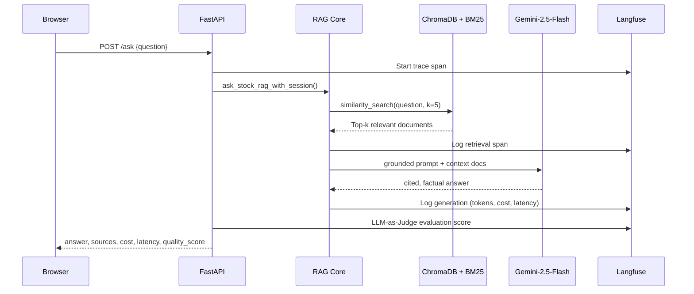
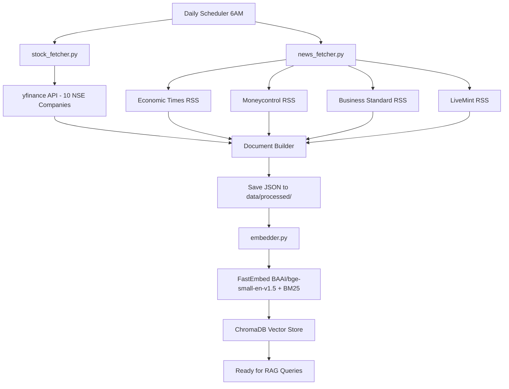
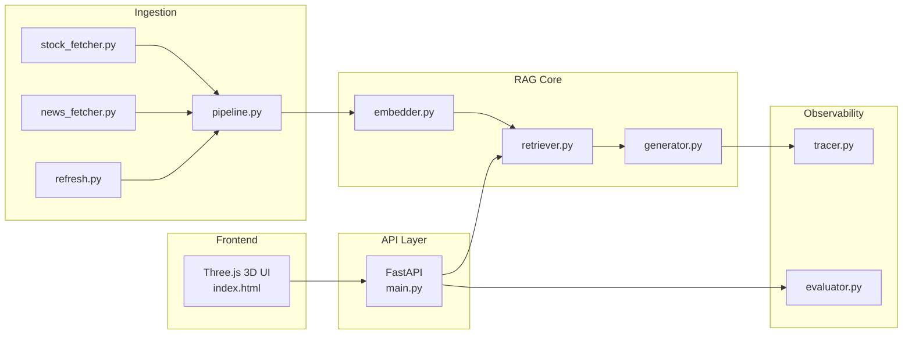
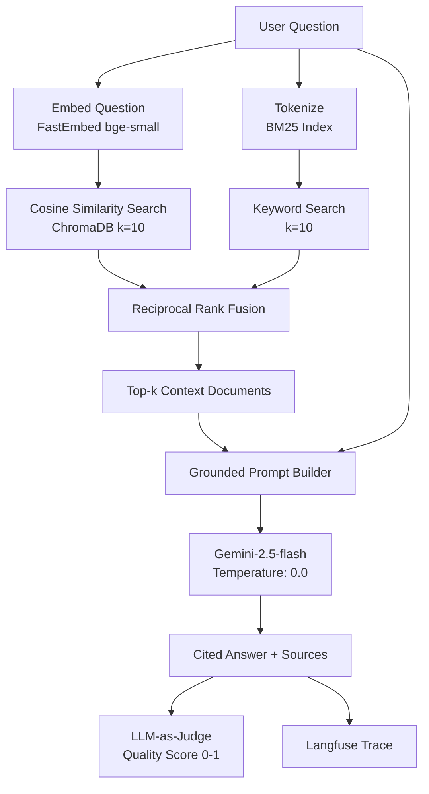
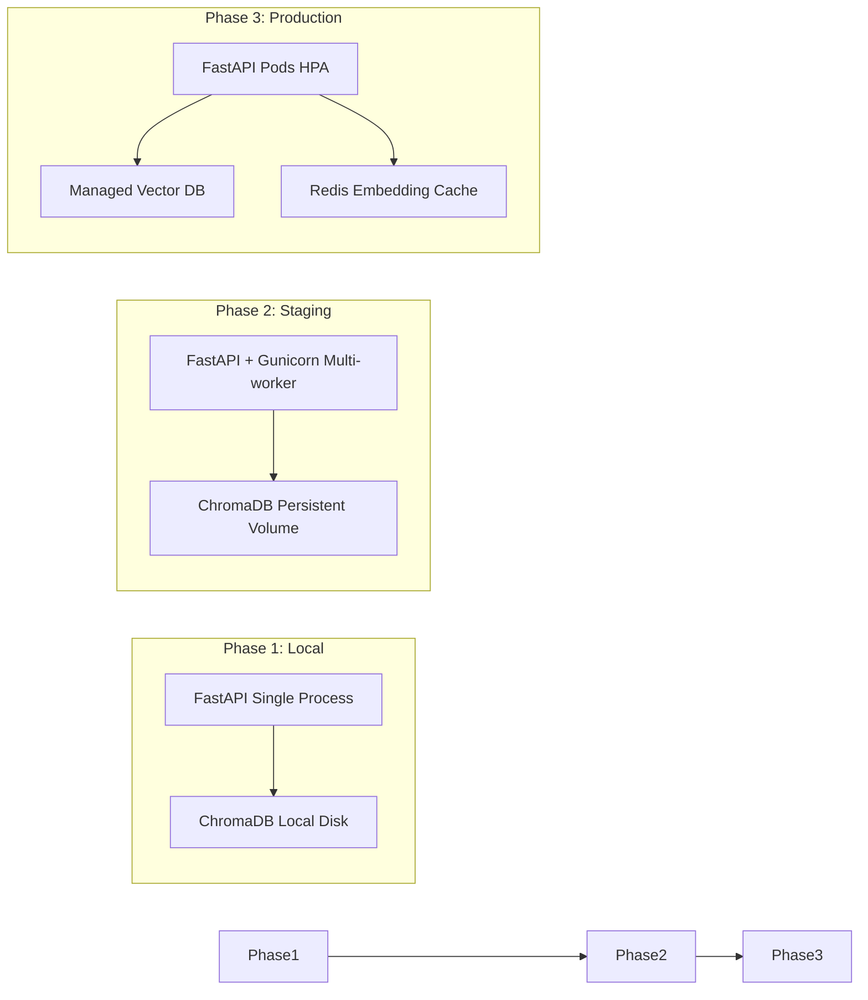
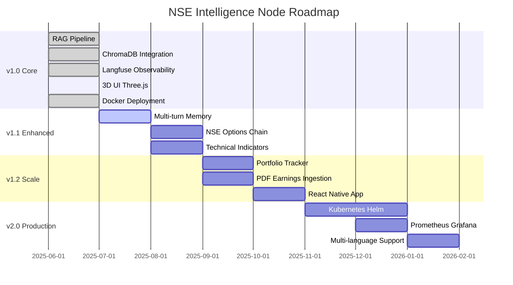

<div align="center">


<br/>

[](https://python.org)
[](https://fastapi.tiangolo.com)
[](https://deepmind.google/technologies/gemini/)
[](https://www.trychroma.com)
[](https://docker.com)
[](https://langfuse.com)

[](LICENSE)
[](https://github.com/AyushGU12/STOCK_MARKET_LLM/releases)
[]()
[](CONTRIBUTING.md)

<br/>

> **"Ask anything about Indian markets. Get answers grounded in real data — not hallucinations."**

[🚀 Quick Start](#-quick-start) · [📖 API Docs](#-api-documentation) · [🧠 AI Pipeline](#-aiml-pipeline) · [🐳 Docker Deploy](#-deployment) · [📊 Observability](#-monitoring--observability) · [🤝 Contributing](#-contributing)

</div>

---

## 📋 Table of Contents

<details>
<summary>Click to expand</summary>

- [Executive Overview](#-executive-overview)
- [Architecture](#-architecture)
- [Tech Stack](#-tech-stack)
- [Project Structure](#-project-structure)
- [Features](#-features)
- [Quick Start](#-quick-start)
- [Configuration](#-configuration)
- [API Documentation](#-api-documentation)
- [AI/ML Pipeline](#-aiml-pipeline)
- [Security](#-security)
- [Performance & Scalability](#-performance--scalability)
- [CI/CD](#-cicd)
- [Monitoring & Observability](#-monitoring--observability)
- [Deployment](#-deployment)
- [Roadmap](#-roadmap)
- [Contributing](#-contributing)
- [FAQ](#-faq)
- [Troubleshooting](#-troubleshooting)
- [Changelog](#-changelog)
- [Acknowledgements](#-acknowledgements)
- [License](#-license)

</details>

---

## 🎯 Executive Overview

**NSE Intelligence Node** is a production-grade, full-stack AI application that brings institutional-grade stock market analysis to individual developers, analysts, and traders. It combines a **Retrieval-Augmented Generation (RAG)** pipeline with live NSE/BSE market data, financial news from top Indian outlets (Economic Times, Moneycontrol, Business Standard, LiveMint), and a state-of-the-art LLM to deliver grounded, cited, real-time answers to complex financial questions.

### Why This Exists

Traditional stock research tools either dump raw data (charts, tables) with no interpretation, or rely on LLMs that confidently hallucinate financial figures. **NSE Intelligence Node bridges that gap** — it retrieves verified, timestamped market data and grounds every LLM response in that data, making hallucination structurally impossible.

### Key Highlights

| Capability | Detail |
|---|---|
| 🧠 **Hybrid RAG** | ChromaDB + BM25 Reciprocal Rank Fusion |
| 💬 **LLM** | `gemini-2.5-flash` with grounded, cited prompts |
| ⚔️ **Multi-Agent** | "Bull vs Bear" dual-agent debate system |
| 📡 **Live Data** | Real-time via `yfinance` + 4 RSS news feeds |
| 🔭 **Observability** | Full LLM tracing, cost, latency via Langfuse v3 |
| ⚖️ **Evaluation** | Automated LLM-as-Judge quality scoring on every response |
| 🐳 **Deployment** | One-command Docker Compose |
| 🔄 **Auto-Refresh** | Daily 6 AM vector store refresh (scheduled) |

---

## 🏗️ Architecture

### System Overview

```
┌─────────────────────────────────────────────────────────────────────┐
│                        NSE Intelligence Node                         │
│                                                                       │
│  ┌─────────┐    ┌──────────────┐    ┌────────────┐    ┌──────────┐  │
│  │ Browser │───▶│  FastAPI     │───▶│  RAG Core  │───▶│ Gemini   │  │
│  │ (Three  │    │  /ask &      │◀───│ (Hybrid    │◀───│  2.5     │  │
│  │  .js UI)│◀───│  /debate     │    │  RAG)      │    │  Flash   │  │
│  └─────────┘    └──────┬───────┘    └─────┬──────┘    └──────────┘  │
│                        │                  │                           │
│                 ┌──────▼───────┐   ┌──────▼──────┐                   │
│                 │   Langfuse   │   │  ChromaDB   │                   │
│                 │ (Traces,Cost,│   │ Vector Store│                   │
│                 │  Evals,Score)│   └──────┬──────┘                   │
│                 └──────────────┘          │                           │
│                                    ┌──────▼──────┐                   │
│                                    │  Ingestion  │                   │
│                                    │  Pipeline   │                   │
│                                    │ yfinance +  │                   │
│                                    │ 4 RSS feeds │                   │
│                                    └─────────────┘                   │
└─────────────────────────────────────────────────────────────────────┘
```

### Request Flow



### Data Ingestion Flow



### Component Map



---

## 🛠️ Tech Stack

### AI / ML

| Component | Technology | Purpose |
|---|---|---|
| **LLM** | Google Gemini (2.5 Flash) | Answer generation & Multi-Agent Debate |
| **Embeddings** | FastEmbed (BAAI/bge-small-en-v1.5) | Local lightweight Semantic vectorization |
| **Retrieval** | Hybrid (ChromaDB + BM25) | RRF-based precise retrieval |
| **Orchestration** | Python custom logic | Lightweight LLM execution |
| **Observability** | Langfuse | LLM tracing and evals |

### Backend

| Component | Technology |
|---|---|
| **API Framework** | FastAPI + Uvicorn |
| **Validation** | Pydantic v2 |
| **Market Data** | yfinance |
| **News Feeds** | feedparser (RSS) |
| **Text Splitting** | langchain-text-splitters |
| **Env Management** | python-dotenv |

### Frontend

| Component | Technology |
|---|---|
| **3D Background** | Three.js r134 (WebGL) |
| **UI** | Vanilla HTML/CSS/JS |
| **Typography** | Space Grotesk (Google Fonts) |
| **Effects** | Glassmorphism + CRT Scanlines |

### DevOps

| Component | Technology |
|---|---|
| **Containerization** | Docker + Docker Compose |
| **Deployment** | Railway / Any VPS |
| **CI/CD** | GitHub Actions (planned) |

---

## 📁 Project Structure

```
stock-intelligence-rag/
├── src/
│   ├── api/
│   │   └── main.py              ← FastAPI app, endpoints, lifespan
│   ├── ingestion/
│   │   ├── pipeline.py          ← Ingestion orchestrator
│   │   ├── stock_fetcher.py     ← yfinance NSE/BSE data puller
│   │   ├── news_fetcher.py      ← RSS news feed parser (4 sources)
│   │   └── refresh.py           ← Daily scheduler (6AM cron)
│   ├── rag/
│   │   ├── embedder.py          ← ChromaDB builder, text splitter
│   │   ├── retriever.py         ← Similarity search, k-NN retrieval
│   │   └── generator.py         ← LLM prompt, token/cost tracking
│   └── observability/
│       ├── tracer.py            ← Langfuse spans, sessions, traces
│       └── evaluator.py         ← LLM-as-Judge quality scoring
├── frontend/
│   └── index.html               ← Three.js 3D UI, glassmorphism chat
├── data/
│   └── processed/               ← Timestamped JSON document snapshots
├── tests/
├── Dockerfile
├── docker-compose.yml
├── .dockerignore
├── requirements.txt
├── .env.example
└── README.md
```

---

## ✨ Features

### ✅ Completed

**Core RAG**
- [x] Live NSE/BSE stock data ingestion via `yfinance` (10 companies)
- [x] Real-time news ingestion from 4 top Indian financial RSS feeds
- [x] FastEmbed Local Embeddings (free & fast)
- [x] Hybrid Search (BM25 + ChromaDB) using Reciprocal Rank Fusion (RRF)
- [x] `gemini-2.5-flash` answer generation with grounded prompts
- [x] ⚔️ **Multi-Agent "Bull vs. Bear" Debate** feature
- [x] Source citation in every answer — no hallucinations possible

**Observability**
- [x] Full LLM trace logging via Langfuse v3 context manager API
- [x] Per-request cost tracking (USD, input/output tokens)
- [x] Latency measurement on every request
- [x] Automated LLM-as-Judge quality scoring on every response
- [x] User thumbs up/down feedback collection
- [x] Session-based conversation tracking

**Infrastructure**
- [x] FastAPI production server with async lifespan management
- [x] Dockerized application with `docker-compose.yml`
- [x] Scheduled daily vector store refresh
- [x] CORS middleware
- [x] `/health` liveness probe endpoint
- [x] Pydantic v2 request/response validation

**Frontend**
- [x] Interactive Three.js WebGL 3D background (1,500 particles + wireframe icosahedrons)
- [x] CSS Glassmorphism with real-time mouse-parallax 3D panel tilt
- [x] Animated glitch-decode title effect on hover
- [x] CRT scanlines and film grain cinematic overlay
- [x] Animated neon pulse typing indicator
- [x] Per-response metadata (latency, cost, quality score)

### 🚧 In Progress

- [ ] Multi-turn conversation memory
- [ ] NSE Options chain analysis
- [ ] Technical indicators (RSI, MACD, Bollinger Bands)

### 📌 Planned

- [ ] Portfolio tracker integration
- [ ] PDF earnings report ingestion
- [ ] Voice query interface (Whisper API)
- [ ] React Native mobile app
- [ ] Multi-language support (Hindi, Tamil, Telugu)
- [ ] Kubernetes Helm chart
- [ ] Prometheus + Grafana dashboard

---

## 🚀 Quick Start

### Prerequisites

| Requirement | Version |
|---|---|
| Python | 3.11+ |
| Docker Desktop | Latest |
| OpenAI API Key | Billing account required |
| Langfuse Account | Free cloud tier available |

### 1. Clone

```bash
git clone https://github.com/AyushGU12/STOCK_MARKET_LLM.git
cd STOCK_MARKET_LLM
```

### 2. Virtual Environment

```bash
# Windows (PowerShell)
python -m venv venv
.\venv\Scripts\activate

# macOS / Linux
python3 -m venv venv
source venv/bin/activate
```

### 3. Install Dependencies

```bash
pip install -r requirements.txt
pip install langchain-text-splitters
```

### 4. Configure Environment

```bash
cp .env.example .env
# Fill in your API keys in .env
```

### 5. Run Data Ingestion

```bash
# Windows
$env:PYTHONIOENCODING="utf-8"; python -m src.ingestion.refresh

# macOS / Linux
python -m src.ingestion.refresh
```

> Takes ~2 minutes. Downloads 380+ stock documents + 89+ news articles and builds the ChromaDB vector store.

### 6. Start Server

```bash
python -m uvicorn src.api.main:app --host 127.0.0.1 --port 8000
```

### 7. Open UI

```
http://127.0.0.1:8000/static/index.html
```

**Example queries:**
- `"Why did Reliance Industries fall last week?"`
- `"Compare TCS and Infosys performance"`
- `"What is the outlook for HDFC Bank?"`

---

## ⚙️ Configuration

### `.env.example`

```dotenv
# Required. Get from: https://aistudio.google.com/
GEMINI_API_KEY=your-gemini-api-key-here

# Required. Get from: https://cloud.langfuse.com -> Settings -> API Keys
LANGFUSE_PUBLIC_KEY=pk-lf-your-public-key-here
LANGFUSE_SECRET_KEY=sk-lf-your-secret-key-here
LANGFUSE_HOST=https://cloud.langfuse.com

# Options: development | staging | production
LANGFUSE_ENVIRONMENT=development
```

| Variable | Required | Description |
|---|---|---|
| `GEMINI_API_KEY` | Yes | Gemini API key for LLM generation |
| `LANGFUSE_PUBLIC_KEY` | Yes | Langfuse project public key |
| `LANGFUSE_SECRET_KEY` | Yes | Langfuse project secret key |
| `LANGFUSE_HOST` | Yes | Langfuse host URL |
| `LANGFUSE_ENVIRONMENT` | Optional | Environment label in Langfuse |

> **Never commit your `.env` file to Git.** It is already in `.gitignore`.

---

## 📖 API Documentation

**Base URL:** `http://localhost:8000`

**Swagger UI:** `http://localhost:8000/docs`

### Endpoints

| Method | Endpoint | Description |
|---|---|---|
| `GET` | `/health` | Liveness probe |
| `POST` | `/ask` | Main RAG query |
| `POST` | `/feedback` | Submit quality feedback |
| `GET` | `/companies` | List supported companies |

#### `POST /ask`

```json
// Request
{
  "question": "Why did Reliance Industries drop last week?",
  "user_id": "user_123",
  "session_id": "session_abc"
}

// Response
{
  "answer": "Reliance Industries declined approximately 3.2% last week...",
  "sources": ["Economic Times: ...", "Moneycontrol: ..."],
  "companies": ["RELIANCE.NS"],
  "latency_seconds": 2.847,
  "quality_score": 0.87,
  "trace_id": "trace_01j2xyz...",
  "session_id": "session_abc",
  "cost_usd": 0.0012
}
```

#### Status Codes

| Code | Meaning |
|---|---|
| `200` | Success |
| `400` | Bad Request |
| `422` | Validation Error |
| `500` | Pipeline Error |

---

## 🧠 AI/ML Pipeline

### RAG Flow



### Prompt Engineering

```
You are an expert Indian stock market analyst.
Use ONLY the following market data and news context to answer the question.
If the answer cannot be found in the provided context, say
"I don't have sufficient data for this query" — do NOT speculate.

CONTEXT:
{retrieved_documents}

QUESTION: {user_question}

Provide a specific, factual answer with citations from the context above.
```

### Vector Store Parameters

| Parameter | Value |
|---|---|
| Embedding Model | `BAAI/bge-small-en-v1.5` (FastEmbed) |
| Search Type | Hybrid (ChromaDB + BM25 Okapi) |
| Fusion Strategy | Reciprocal Rank Fusion (RRF, k=60) |
| Top-k Retrieval | 6 documents |
| Vector Store | ChromaDB (local persistent) |

### Data Sources

| Source | Type | Refresh |
|---|---|---|
| yfinance NSE tickers | Price, volume, financials | Daily 6AM |
| Economic Times RSS | Market news | Daily 6AM |
| Moneycontrol RSS | Market news | Daily 6AM |
| Business Standard RSS | Market news | Daily 6AM |
| LiveMint RSS | Market news | Daily 6AM |

---

## 🔐 Security

| Layer | Mechanism |
|---|---|
| **CORS** | FastAPI CORS middleware |
| **Input Validation** | Pydantic v2 type enforcement |
| **Input Length** | Max 500 character limit |
| **Secrets** | `.env` file excluded via `.gitignore` |
| **Grounding** | RAG prevents prompt injection via LLM separation |

### Production Hardening (Recommended)

```python
from fastapi.security import APIKeyHeader
from fastapi import Security

API_KEY_HEADER = APIKeyHeader(name="X-API-Key")

@app.post("/ask")
async def ask(req: QueryRequest, api_key: str = Security(API_KEY_HEADER)):
    if api_key != os.getenv("API_SECRET_KEY"):
        raise HTTPException(403, "Invalid API Key")
```

---

## ⚡ Performance & Scalability

### Scaling Path



### Performance Considerations

- **Embedding Cache**: Cache repeated question embeddings to reduce OpenAI calls
- **Async I/O**: FastAPI async endpoints prevent blocking on LLM calls
- **Batch Ingestion**: Documents batch-embedded at ingestion time, not per-query
- **Production Workers**: `gunicorn -w 4 -k uvicorn.workers.UvicornWorker src.api.main:app`
- **HNSW Index**: ChromaDB uses HNSW for sub-millisecond vector search

---

## 🔄 CI/CD

### GitHub Actions (Planned)

```yaml
name: CI Pipeline
on:
  push:
    branches: [main, develop]

jobs:
  test:
    runs-on: ubuntu-latest
    steps:
      - uses: actions/checkout@v4
      - uses: actions/setup-python@v5
        with:
          python-version: '3.11'
      - run: pip install -r requirements.txt
      - run: pytest tests/ -v --cov=src
      - run: python -m black --check src/

  docker-build:
    needs: test
    runs-on: ubuntu-latest
    steps:
      - uses: actions/checkout@v4
      - run: docker build -t nse-intelligence-node:latest .
```

### Branch Strategy

| Branch | Purpose |
|---|---|
| `main` | Production stable — protected |
| `develop` | Integration branch — protected |
| `feature/*` | New features |
| `fix/*` | Bug fixes |
| `hotfix/*` | Critical production fixes |

### Commit Convention

| Prefix | Description |
|---|---|
| `feat:` | New feature |
| `fix:` | Bug fix |
| `docs:` | Documentation |
| `refactor:` | Code refactoring |
| `test:` | Tests |
| `chore:` | Build, CI |
| `perf:` | Performance |

---

## 📊 Monitoring & Observability

### Langfuse Trace Structure

```
Trace
├── Session ID
├── User ID
├── Span: stock-retrieval
│   ├── Input: user question
│   └── Output: document count retrieved
└── Generation: llm-generation
    ├── Model: gpt-4o-mini
    ├── Input tokens
    ├── Output tokens
    ├── Cost (USD)
    └── Latency (ms)
```

### Metrics Tracked

| Metric | Tool |
|---|---|
| LLM Cost per query | Langfuse auto-tracking |
| Response latency | Langfuse span timing |
| Quality score | LLM-as-Judge evaluation |
| User feedback | Thumbs up/down scores |
| Error rate | FastAPI 5xx logs |

### Health Check

```bash
curl http://localhost:8000/health
# {"status":"healthy","observability":"langfuse","version":"1.0.0"}
```

---

## 🐳 Deployment

### Docker Compose (Recommended)

```bash
# Build and start all services
docker-compose up -d

# View logs
docker-compose logs -f app

# Stop everything
docker-compose down
```

### Docker Single Container

```bash
docker build -t nse-intelligence-node:latest .
docker run -p 8000:8000 --env-file .env nse-intelligence-node:latest
```

### Railway Cloud Deployment

```bash
npm install -g @railway/cli
railway login
railway init
railway variables set OPENAI_API_KEY=sk-...
railway variables set LANGFUSE_PUBLIC_KEY=pk-lf-...
railway variables set LANGFUSE_SECRET_KEY=sk-lf-...
railway variables set LANGFUSE_HOST=https://cloud.langfuse.com
railway up
```

---

## 🗺️ Roadmap



---

## 🤝 Contributing

### Getting Started

```bash
# Fork the repo, then:
git clone https://github.com/YOUR_USERNAME/STOCK_MARKET_LLM.git
cd STOCK_MARKET_LLM
git checkout -b feature/your-feature-name

# Make changes, then commit
git add .
git commit -m "feat: add NSE options chain ingestion"
git push origin feature/your-feature-name
# Open a Pull Request
```

### Pull Request Checklist

- [ ] Code formatted with Black
- [ ] Tests added for new functionality
- [ ] `.env.example` updated for new env vars
- [ ] `requirements.txt` updated for new packages
- [ ] No API keys or secrets committed

---

## ❓ FAQ

<details>
<summary><b>Why is the vector store empty on first run?</b></summary>

Run the ingestion pipeline after setting up your `.env`:
```bash
$env:PYTHONIOENCODING="utf-8"; python -m src.ingestion.refresh
```
</details>

<details>
<summary><b>Why am I getting OpenAI Error 429?</b></summary>

Your account has no billing credits. Add a payment method at [platform.openai.com/account/billing](https://platform.openai.com/account/billing). $5 is sufficient for extensive testing.
</details>

<details>
<summary><b>Can I use a different LLM?</b></summary>

Yes. In `src/rag/generator.py`, replace `ChatOpenAI` with `ChatOllama`, `ChatGroq`, or any LangChain-compatible provider.
</details>

<details>
<summary><b>Can I add more companies?</b></summary>

Yes. In `src/ingestion/stock_fetcher.py`, add valid yfinance tickers to the `COMPANIES` dictionary (e.g., `"BAJFINANCE.NS": "Bajaj Finance"`).
</details>

<details>
<summary><b>The 3D animation is slow. Can I disable it?</b></summary>

Delete the Three.js `<script>` block in `frontend/index.html`. The chat interface works without it.
</details>

---

## 🔧 Troubleshooting

| Issue | Cause | Fix |
|---|---|---|
| `UnicodeEncodeError` on Windows | CP1252 terminal encoding | Use `$env:PYTHONIOENCODING="utf-8"` prefix |
| `openai.RateLimitError 429` | No OpenAI billing credits | Add payment at platform.openai.com/billing |
| `ModuleNotFoundError: langchain_text_splitters` | Missing package | `pip install langchain-text-splitters` |
| `422 Unprocessable Entity` on `/ask` | Pydantic type mismatch | Ensure `Optional[str]` in `QueryRequest` |
| No results from ChromaDB | Ingestion not run | Run `python -m src.ingestion.refresh` |
| Langfuse traces not appearing | Wrong keys or host | Verify `LANGFUSE_HOST=https://cloud.langfuse.com` |

### Debug Commands

```bash
# Test API directly
curl -X POST http://localhost:8000/ask \
  -H "Content-Type: application/json" \
  -d '{"question": "How did TCS perform?"}'

# Check ChromaDB document count
python -c "
import chromadb
client = chromadb.PersistentClient(path='./data/chroma')
col = client.get_or_create_collection('stock_intelligence')
print('Documents in vector store:', col.count())
"
```

---

## 📜 Changelog

### v1.0.0 — July 2025

- Full RAG pipeline with ChromaDB + OpenAI embeddings
- Live NSE/BSE data ingestion for 10 companies via yfinance
- 4 RSS news feed ingestion (ET, Moneycontrol, BS, LiveMint)
- GPT-4o-mini answer generation with grounded prompts
- Langfuse v3 full observability (traces, cost, latency)
- LLM-as-Judge automated quality scoring
- Three.js 3D interactive frontend with glassmorphism
- FastAPI REST API with Pydantic v2 validation
- Docker + Docker Compose deployment
- Daily scheduled vector store refresh

---

## 🙏 Acknowledgements

| Resource | Contribution |
|---|---|
| [LangChain](https://github.com/langchain-ai/langchain) | RAG orchestration framework |
| [ChromaDB](https://www.trychroma.com) | Open-source vector database |
| [Langfuse](https://langfuse.com) | LLM observability platform |
| [FastAPI](https://fastapi.tiangolo.com) | High-performance Python API framework |
| [yfinance](https://github.com/ranaroussi/yfinance) | Yahoo Finance market data wrapper |
| [Three.js](https://threejs.org) | 3D WebGL rendering library |
| [OpenAI](https://openai.com) | GPT-4o-mini + Embeddings API |
| Lewis et al. 2020 | Retrieval-Augmented Generation for Knowledge-Intensive NLP Tasks |

---

## 📄 License

```
MIT License

Copyright (c) 2025 AyushGU12

Permission is hereby granted, free of charge, to any person obtaining a copy
of this software and associated documentation files (the "Software"), to deal
in the Software without restriction, including without limitation the rights
to use, copy, modify, merge, publish, distribute, sublicense, and/or sell
copies of the Software, and to permit persons to whom the Software is
furnished to do so, subject to the following conditions:

The above copyright notice and this permission notice shall be included in all
copies or substantial portions of the Software.

THE SOFTWARE IS PROVIDED "AS IS", WITHOUT WARRANTY OF ANY KIND, EXPRESS OR
IMPLIED, INCLUDING BUT NOT LIMITED TO THE WARRANTIES OF MERCHANTABILITY,
FITNESS FOR A PARTICULAR PURPOSE AND NONINFRINGEMENT.
```

---

<div align="center">


**Built with love for the Indian Developer Community**

[](https://github.com/AyushGU12)

**Star this repository if it helped you — it keeps the project alive!**

*"The best analysts don't just look at charts. They understand the story behind the numbers."*

</div>
